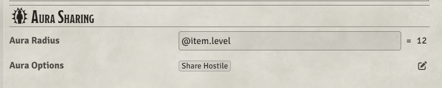
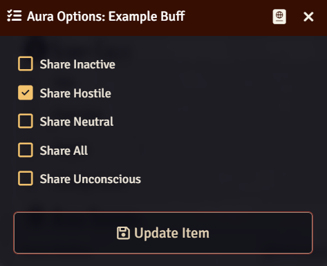
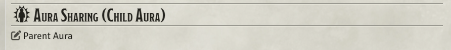

## I've taken over maintenance of this module from Fiona, so this is the repository going forward

<strong>This mod is presently compatible with Pathfinder 1e</strong>

Aura Share: Automates the sharing of buffs between tokens. This makes handling auras easier. The conditions for automating the auras are listed in the notes below. (It's pretty simple)

## Instructions:

Create a buff (item on a character sheet) and give it a radius.

...the buff now automatically shares depending on the flags below:    

- Share Inactive  shares the buff even if it is toggled off. Great for buffs that only impact allies.    
- Share Hostile  shares the buff with enemies (instead of allies). Typically combined with Share Inactive.    
- Share Neutral   shares the buff with targets with neutral disposition.    
- Share All   shares the buff with everyone regardless of disposition.    
- Share Unconscious  shares the buff even if you're unconscious. (This works like the Diehard feat, but allows DMs more control over individual auras.)    

Child auras have a simplified UI that allows them to see the parent aura (if they have permission to view it)

## Conditions for Applying Auras  

<strong>Adds the buff to allies if:</strong>  

- The source actor has a buff with a radius > 0.  
- The buff is enabled, OR if the source actor's buff has the Share Inactive option.  

<strong>Adds the buff to allies when:</strong>  

- They enter range (either actor can move).  
- The buff is toggled on.  
- A Token is created in the scene, and allies are in range.  
- The aura actor's HP rises above 0.  

<strong>Adds the buff to enemies if:</strong>  

- The buff also has the Share Hostile option. Note: You typically would combine this with the Share Inactive option so that the buff doesn't hurt the source actor.  

<strong>Deactives or Deletes the buff when:</strong>  
NOTE: These can be toggled between activate auras and delete auras in the module settings  

- The source moves out of range.  
- The recipient moves out of range.  
- The source disables the buff, and the buff does not have the "alliesOnly" Boolean Flag  
- The source's HP falls below zero, unless: It has the Diehard feat -OR- Unconscious Auras is toggled OFF in the menus.  

<strong>Deletes the buff when:</strong>  

- the source is deleted.
